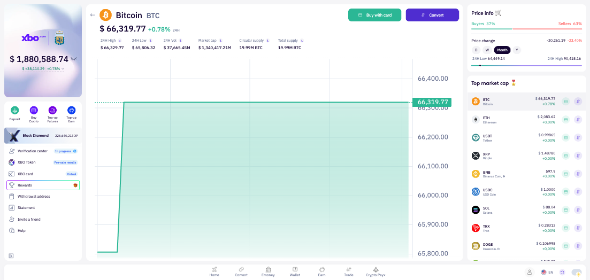
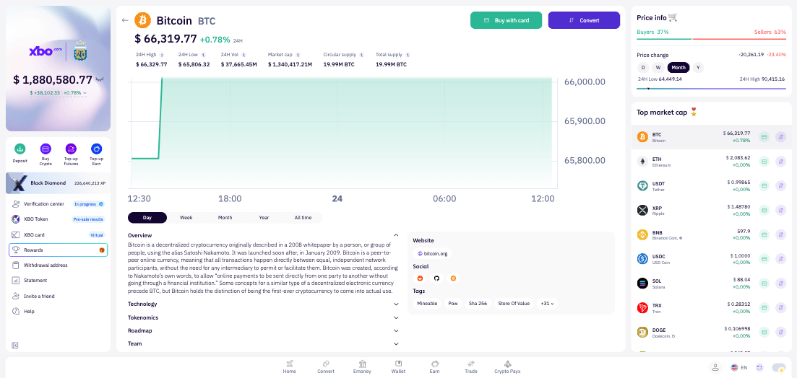
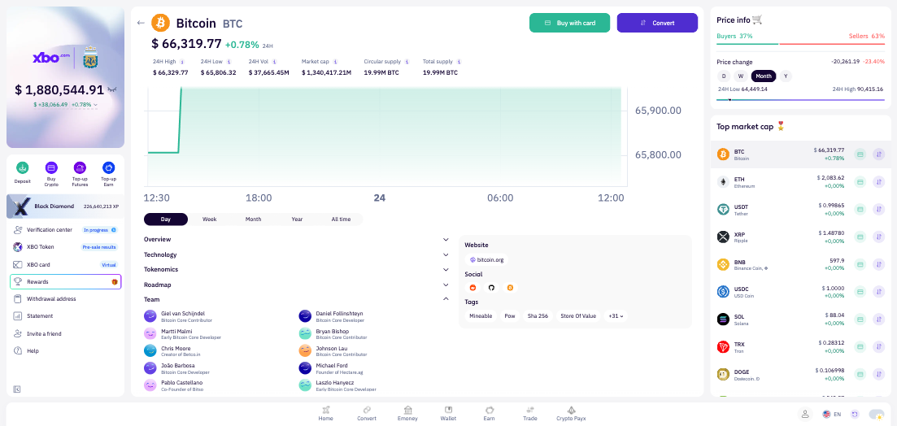
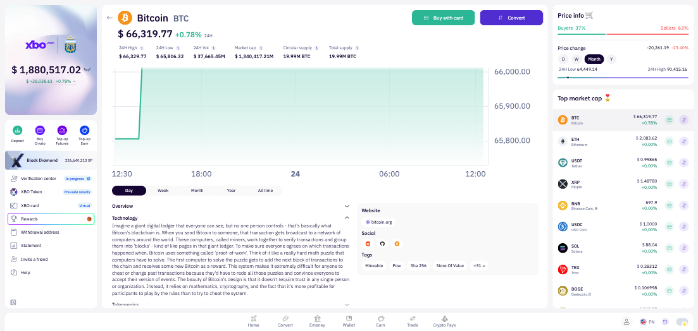
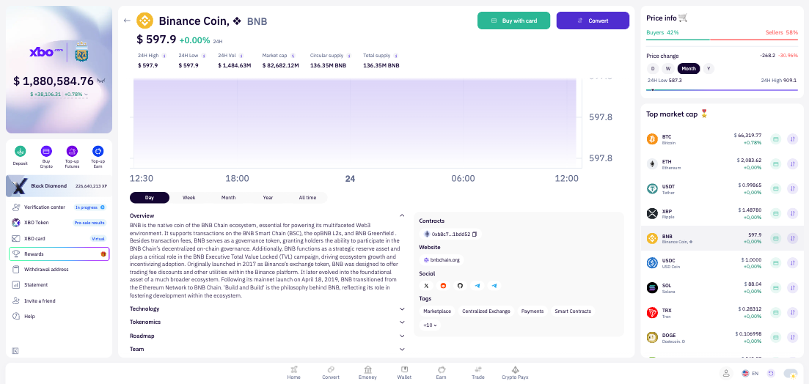
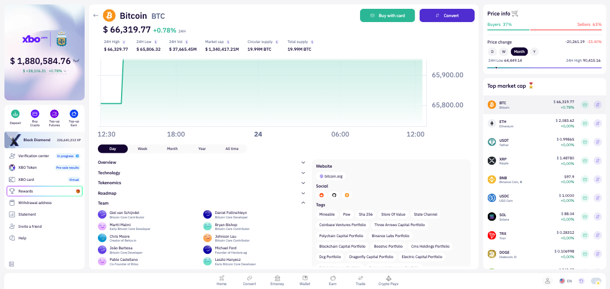
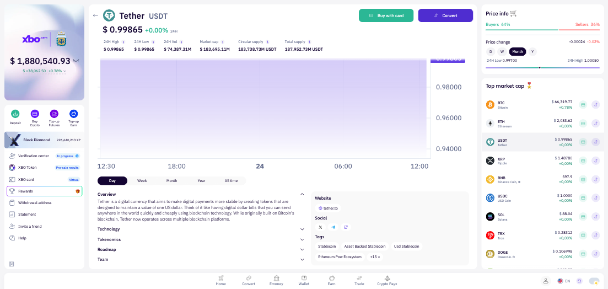

# Demo QA Session Report

**Session**: 111861-asset-page-cmc-part2
**Date**: 2026-02-24
**Tester**: Demo Agent (AI)
**Task**: #111861 — [web] Extend Asset page with additional data from CMC - part 2
**App URL**: https://www.xbo-dev.space-app.io/platform

## Test Results

Total: 9 | Passed: 9 | Failed: 0 | Skipped: 0

| ID | Scenario | Result | Screenshot | Notes |
|----|----------|--------|------------|-------|
| TC-1 | Coin header shows Circulating Supply and Total Supply for BTC | PASS |  | "Circular supply: 19.99M BTC" and "Total supply: 19.99M BTC" visible in header. Note: label reads "Circular supply" (not "Circulating supply"). |
| TC-2 | Token Overview section visible and collapsed for BTC | PASS |  | Overview expanded by default with full description. Technology, Tokenomics, Roadmap, Team all rendered as collapsed buttons. |
| TC-3 | Technology, Tokenomics, Roadmap sections visible for BTC | PASS |  | All three sections present as collapsed buttons in the left panel. |
| TC-4 | Team section visible for BTC | PASS |  | Team section expanded showing 10+ team members with names and roles (e.g. Giel van Schijndel, Daniel Follinshteyn, Martti Malmi, etc.). |
| TC-5 | Websites, Socials, Tags visible for BTC (right side, not collapsed) | PASS |  | Website (bitcoin.org), Social (Reddit, GitHub, Message Board), Tags (Mineable, Pow, Sha 256, Store Of Value, +31) all visible in right panel without collapsing. |
| TC-6 | Only one section can be expanded at a time | PASS |  | Clicking Technology while Overview was open auto-collapsed Overview. Then clicking Team collapsed Technology. Accordion behavior confirmed. |
| TC-7 | BNB asset page shows Contracts section | PASS |  | Contracts section visible with Ethereum contract address (0xb8c7...1bdd52). BNB shows 1 contract — no +N bubble needed at this count. |
| TC-8 | Tags section shows +N bubble and Show More when many tags exist | PASS |  | BTC Tags shows "+31" bubble. Clicking it expands all 31 additional tags (State Channel, Coinbase Ventures Portfolio, etc.). BNB shows "+10", USDT shows "+15". |
| TC-9 | Missing section not shown for token with limited data | PASS |  | USDT has no "Contracts" section in right panel (no DP/WD contracts on XBO for USDT). All other sections (Overview, Technology, Tokenomics, Roadmap, Team) are present as USDT has CMC data for those. |

## Mocks Applied

none

## Bugs / Observations

### Minor observation for TC-1: "Circular supply" label spelling
- **URL**: https://www.xbo-dev.space-app.io/platform/coin/BTC
- **Expected**: Field labeled "Circulating supply" (as stated in AC)
- **Actual**: Field label reads "Circular supply" — may be a cosmetic typo or intentional abbreviation
- **Console errors**: none
- **Network**: n/a (UI-only observation)
- **Screenshot**: 

### Observation for TC-7: BNB shows only 1 contract — +N bubble not triggered
- **URL**: https://www.xbo-dev.space-app.io/platform/coin/BNB
- **Expected**: Per test case 117996, a +N bubble and "Show more" when many contracts
- **Actual**: BNB has only 1 registered contract on XBO — the +N bubble correctly does not appear. This is expected behavior. A token with many DP/WD contracts would be needed to fully verify test case 117996.
- **Screenshot**: 
