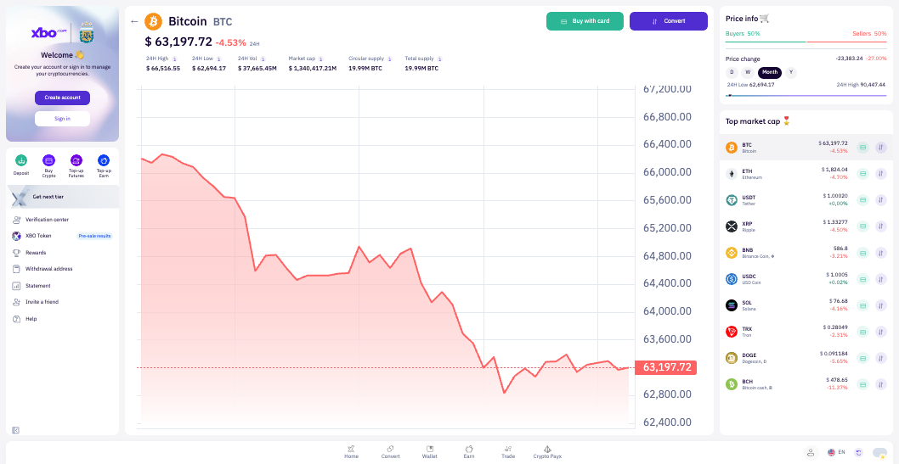
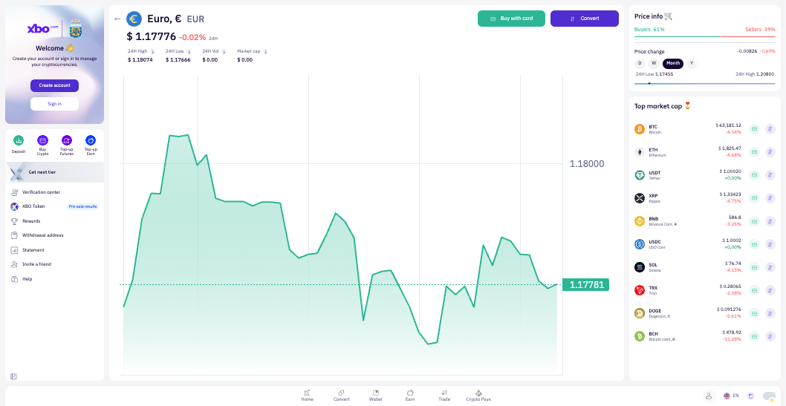
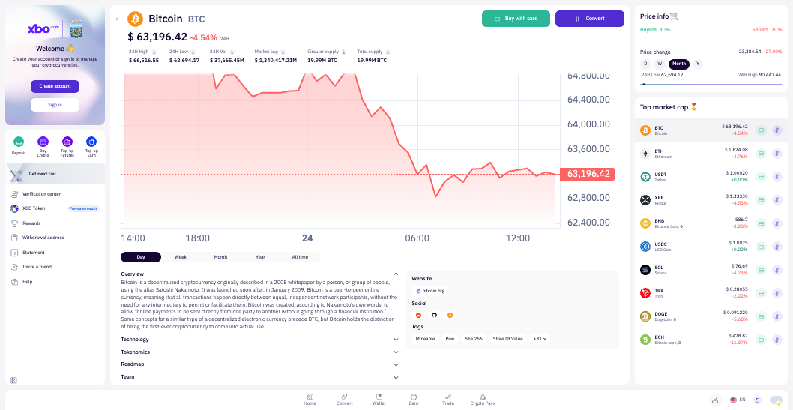
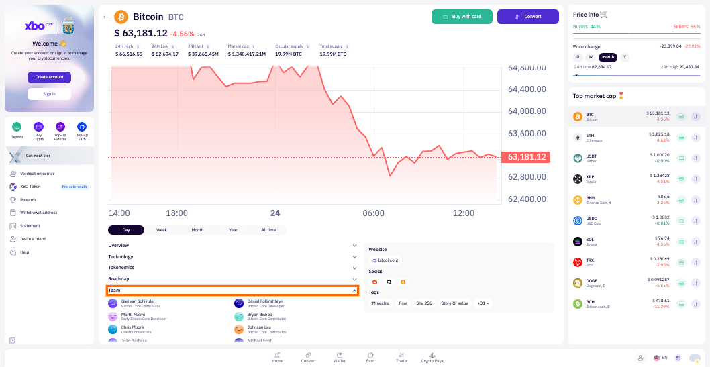
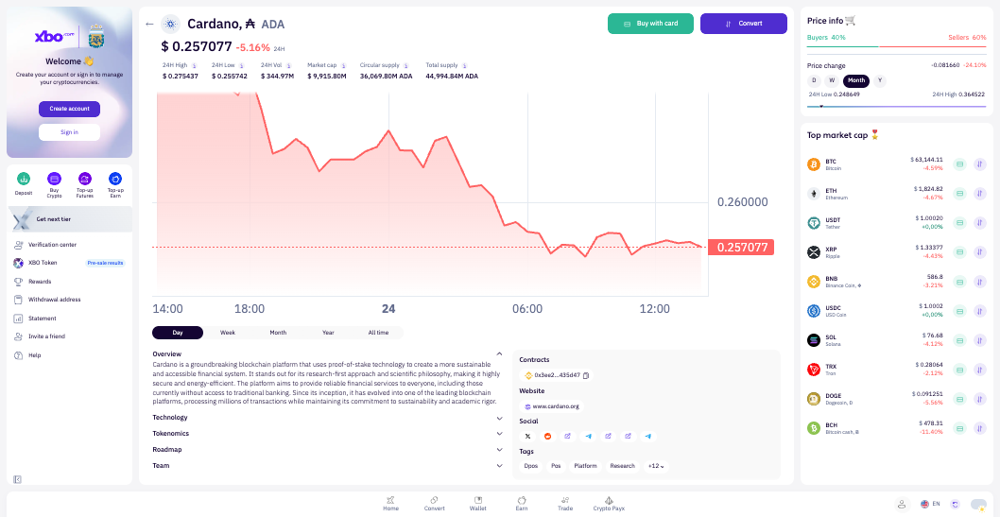
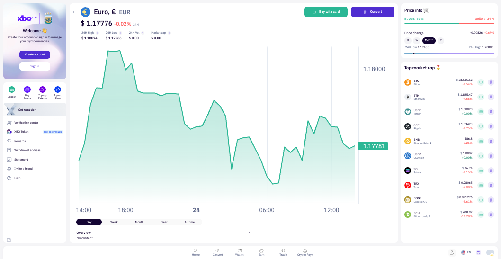
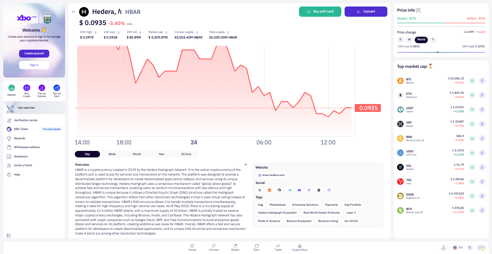
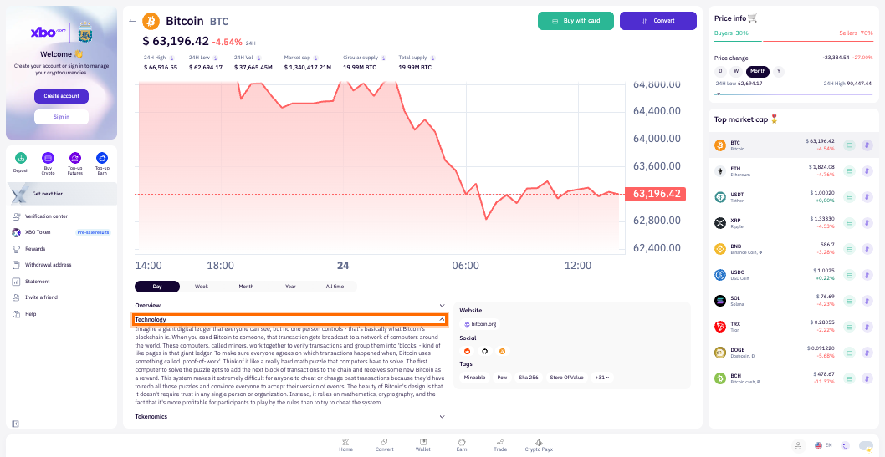

# Demo QA Session Report

**Session**: 111861-extend-asset-page-cmc-part-2_2026-02-24_00-00
**Date**: 2026-02-24
**Tester**: Demo Agent (AI)
**Task**: #111861 - [web] Extend Asset page with additional data from CMC - part 2
**App URL**: https://www.xbo-dev.space-app.io/platform

## Test Results

Total: 17 | Passed: 13 | Failed: 1 | Skipped: 2 | N/A: 1

| ID | Scenario | Result | Screenshot | Notes |
|----|----------|--------|------------|-------|
| TC-1 | Total Supply and Circulating Supply shown in header (BTC) | PASS |  | BTC shows "Circular supply: 19.99M BTC" and "Total supply: 19.99M BTC" in header |
| TC-2 | Total Supply and Circulating Supply hidden when data missing (EUR) | PASS |  | EUR has totalSupply=null; header shows only 24H High/Low/Vol and Market cap |
| TC-3 | Token Overview section shown when data present (BTC) | PASS |  | Overview expanded by default with full Bitcoin description |
| TC-4 | Token Overview section hidden when data missing | FAIL |  | EUR shows "Overview" section with "No content" text instead of hiding the section entirely |
| TC-5 | Technology section shown (BTC) / hidden (HBAR) | PASS |  | BTC has Technology button; HBAR has no Technology section |
| TC-6 | Roadmap section shown (BTC) / hidden (HBAR) | PASS |  | BTC has Roadmap button; HBAR has no Roadmap section |
| TC-7 | Team section shown (BTC) / hidden (HBAR) | PASS |  | BTC Team section expands to show list of people with names and roles; HBAR has no Team section |
| TC-8 | Team section hidden when JSON data broken | SKIP | — | No token available in production with broken team JSON |
| TC-9 | Tokenomics section shown (BTC) / hidden (HBAR) | PASS |  | BTC has Tokenomics button; HBAR has no Tokenomics section |
| TC-10 | Contracts section shown (ADA) / hidden (HBAR) | PASS |  | ADA shows "Contracts" heading with contract address; HBAR has no Contracts section |
| TC-11 | Contracts section shows +N bubble with many contracts | SKIP | — | Only ADA (1 contract) and AXS (1 contract) found in production; no token with multiple contracts to test overflow bubble |
| TC-12 | Website section shown (BTC/HBAR) / hidden (EUR) | PASS |  | BTC shows bitcoin.org; HBAR shows www.hedera.com; EUR has no Website section |
| TC-13 | Socials section shown (BTC/HBAR) / hidden (EUR) | PASS |  | BTC/HBAR show Social icons; EUR has no Social section |
| TC-14 | Tags section shown (BTC/HBAR) / hidden (EUR) | PASS |  | BTC/HBAR show Tags; EUR has no Tags section |
| TC-15 | Tags section shows +N bubble with many tags | PASS |  | HBAR shows "+8" bubble; BTC shows "+31" bubble; clicking expands all tags |
| TC-16 | Only one collapsible section open at a time | PASS |  | Clicking Technology collapses Overview; only Technology shown expanded |
| TC-17 | Sections collapsed by default (except Contracts and URLs) | PASS |  | Overview expanded by default; Technology/Tokenomics/Roadmap/Team collapsed; Website/Social/Tags always visible (non-collapsible) |

## Mocks Applied

none

## Bugs / Observations

### Bug for TC-4: Overview section shown with "No content" for tokens with no description data

- **URL**: https://www.xbo-dev.space-app.io/platform/coin/EUR
- **Expected**: "Overview" section should NOT be rendered at all when no overview content exists (per AC: "If some of the content doesn't exist (on both CMC and CRM), then the section is not shown at all")
- **Actual**: The "Overview" collapsible section IS rendered and shows "No content" placeholder text for EUR (and likely other tokens where description = only the coin name)
- **Console errors**: none related to this issue
- **Network**: GET /trading-gateway/v1/coins/EUR/info returns { description: "Euro, €" } — no extended overview data
- **Screenshot**: 

### Observation: TC-11 (Contracts +N bubble) could not be verified

No token on the platform currently has more than 1 contract address. Only ADA and AXS have 1 contract each. The "+N bubble and show more button" behavior for Contracts (TC-11) cannot be confirmed or denied with the current live data. Manual verification with a seeded multi-contract token is recommended.

### Observation: TC-8 (Team hidden when JSON broken) could not be verified

No token on the platform has malformed/broken team JSON in the current live environment. This test case requires either a dedicated test environment with corrupted data or a mock. Could not validate behavior.

### Observation: Circular Supply field labeled "Circular supply" in UI

The field label in the header reads "Circular supply" rather than "Circulating supply." This may be intentional styling but is worth noting against CMC standard terminology.
